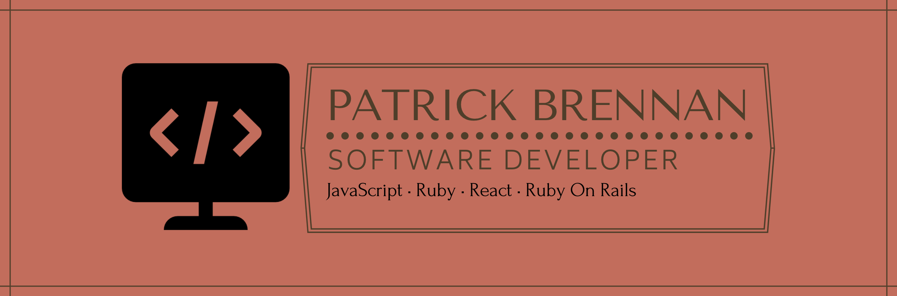

# Hi There! 👋 My name is Patrick Brennan.

## I am a Fullstack Software Developer. Over the last ten years I have built a career teaching, writing, composing, producing and performing music. I am transitioning into Software Development to better utilize my unique skill set in today’s rapidly-changing technological landscape. My strengths lie in collaboration, communication, analysis and design.

- 🔭 I’m currently working on <b>ZKLadder</b>
- 🌱 I’m currently learning Typescript, Recoil, Node.js and Solidity.
- 👯 I’m looking to collaborate on: Anything and Everything.
- 📫 How to reach me: pbrennanmusic@gmail.com
- 😄 Pronouns: he/him
- ⚡ Fun fact: I have a 2 1/2 year old son, and he is the most adorable thing on this planet.

# Projects

### Cinemaddict – <a href="https://youtu.be/JGTOMgUpDwY">Demo</a> | <a href="https://github.com/pbrzn/cinemaddict">Repo</a>
🎬 A Letterboxd-style movie rating/reviewing app. Frontend: React, Redux, JavaScript. Backend: Ruby on Rails.

### JavaScript JEOPARDY!™ – <a href="https://youtu.be/IH0U09Q0bz8">Demo</a> | <a href="https://github.com/pbrzn/js-jeopardy">Repo</a>
📚 A full-scale JEOPARDY!™ game. Frontend: JavaScript. Backend: Ruby on Rails.

### BANDBUILDER – <a href="https://youtu.be/48naaH7YaVU">Demo</a> | <a href="https://github.com/pbrzn/bandbuilder">Repo</a>
🎸 A social networking app for musicians. Built with Ruby on Rails.
